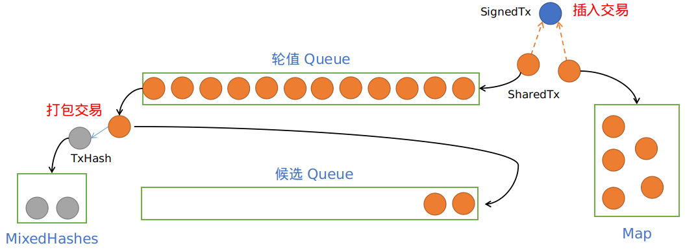

# Mempool

## 设计要求

Mempool 是节点负责收集新交易以及打包新交易给共识模块进行共识的功能模块。很自然地，我们对 Mempool 会提出一些要求：

1. 性能优秀，在普通计算设备中运行即可达到每秒插入 10000+ 笔交易的性能要求。
2. 公平性，按照收到交易的顺序打包交易。

此外，为了配合共识过程与交易同步过程并发的设计，还有第三个要求：

3. 打包给共识的交易包含两部分：用于共识的 order 交易以及用于同步的 propose 交易。

## 解决方案

### 要求1

要获得优秀的性能，首先要分析交易插入的过程，找到性能瓶颈之处对症解决。一笔交易插入 Mempool 的过程包括：
1. 检查交易池是否已满，以避免内存溢出。
2. 检查交易是否已经被交易池包含，以避免重复插入。
3. 检查交易的签名是否正确，格式是否合规，以避免插入明显错误的交易。
4. 检查交易是否已经上链，以避免共识已上链的交易。

步骤 1, 2 的检查非常快，不是性能瓶颈。

步骤 3 涉及验签，是耗时操作，好在验签是一个独立的计算密集型操作，很适合用高并发来充分挖掘 CPU 性能，以达到提高性能的要求。

随着区块链的不断增长，历史交易数据日益庞大，步骤 4 的查询将会成为性能黑洞。我们通过在交易中设置一个必填的 timeout 字段，以及一个全局约束参数 g 来解决该问题。

具体来说，当某笔交易的 timeout 为 t，若该交易在高度 t 仍未被打包，则会被视为失效而被节点抛弃。为了避免用户设置过高的 timeout，若最新高度为 h 的节点收到的交易的 timeout t > h + g，同样会被节点视为非法而抛弃。在这种机制的约束下，最新高度为 h 的节点仅需保存高度区间为 [h - g, h] 的历史交易用于查重，查重的计算复杂度和存储复杂度均降到了O(g)，与历史交易总量无关。

### 要求2

在交易优先级相同的情况下，如果节点后收到的交易却先被打包，这显然有违公平性。因此，交易池的交易必须按照先入先出的原则进行打包。

然而，如果按照以太坊的 nonce 单调递增的设计（交易中的 nonce 字段的设计是为了确保交易的唯一性），若交易池同时包含多笔同一用户发出的交易，则这些交易之间还需要满足偏序关系，这会给打包机制带来非常大的复杂性。因此，我们采用随机 nonce 的方式生成唯一交易，这种设计还会带来其他一些额外的好处，比如获得了更好的并发执行能力（例如同一个用户发出的多笔交易被同一个区块打包，在以太坊中这些交易必须顺序执行，而采用随机 nonce 后，我们就可以并发执行这些交易），简化钱包的设计（在以太坊中，钱包需要同步最新的 nonce，以避免发出重复的交易，而在我们的设计中就没有这样的要求）。

总之，强制要求一个用户的所有交易保持偏序是没有必要且低效的，如果某些交易之间存在某种依赖关系，我们可以使用 ref 字段来表示这种关系，以此获得比以太坊更通用的依赖表达，比如用于表示不同用户之间交易的依赖关系。并且我们的顺序打包方案可以很容易地扩展到满足这种依赖需求。

### 要求3

由于区块链是一个分布式系统，不同节点的交易池所包含的交易集合不会完全相同。共识过程与交易同步打包的核心思想是，在交易池中包含的交易很多，无法被一次共识完成的情况下（受限于 cycle_limit，类似以太坊的 gas_limit），未参与共识的交易的同步过程可以与共识过程并发进行。通过这样的设计，在下一个高度的共识开始的时候，参与共识的交易的同步过程已经提前一个高度开始了，共识效率因此得到了提升。

具体来说，就是交易池打包的时候，在 order 交易满了之后，继续打包交易作为 propose 交易。在共识的时候，leader 节点发出的提案中包含了 order 交易 和 propose 交易（提案中包含的实际上都是交易哈希，在共识过程中，我们采用的是 compact block 的设计）。order 交易参与共识，而 propose 交易开始同步。

注：compact block 设计，leader 发送的 proposal 中仅包含交易哈希，收到 proposal 的节点检查交易哈希是否在本地 Mempool 中，如果没有则向 leader 请求缺失的完整交易。通过 compact block 的设计，可以减少交易传输量，提高带宽利用率。

## 具体设计

根据以上分析，我们需要的是一个可以支持高并发插入交易，遵循先入先出原则打包交易，打包有不同用途的两类交易的 Mempool。

为了满足以上要求，我们用 Map 和 Queue 结构共享存储交易数据，Map 可快速查询和删除，而 Queue 满足先入先出的打包要求。事实上，我们用了两个 queue，就像两个杯子交替倒牛奶。Mempool 的核心数据结构如下：

```rust
struct TxCache {
    /// 用 queue 实现先入先出的打包功能. 
    /// 用两个 queue 轮流存储交易. 一个 queue 当前轮值, 另一个则作为替补. 
    /// 打包时从当前轮值的 queue 中顺序打包.
    queue_0: Queue<SharedTx>,
    queue_1: Queue<SharedTx>,
    /// 用 map 完成高效的随机查询和删除交易.
    map: Map<Hash, SharedTx>,
    /// 指示当前轮值的 queue, true 为 queue_0, false 为 queue_1.
    is_zero: AtomicBool,
    /// 用于原子操作，以妥善处理打包与插入的并发问题. 
    concurrent_count: AtomicUsize,
}

/// 用于 map 和 queue 中共享的交易结构
type SharedTx = Arc<TxWrapper>;

struct TxWrapper {
    tx: SignedTransaction,
    /// 该交易是否被 map 删除，有该标识的交易在打包交易时会被跳过，并且从 queue 中删除
    removed: AtomicBool,
    /// 避免重复同步的标识，有该标识的交易在打包 propose 交易时会被跳过
    proposed: AtomicBool,
}

/// 用于存储共识同步返回的交易
type CallbackCache = Map<Hash, SignedTransaction>;

/// Mempool 打包返回给共识模块的数据结构
struct MixedTxHashes {
    order_tx_hashes: Vec<Hash>,
    propose_tx_hashes: Vec<Hash>,
}
``` 

通过所有检查的新交易在插入 Mempool 时，首先包装为 `TxWrapper`（`removed` 和 `proposed` 均设置为 `false`）。然后转换为 `SharedTx` 并插入 `TxCache` 中（插入当前轮值的 `queue` 的尾部，以及 `map` 中）。 

Mempool 收到共识的打包请求时，返回 `MixedTxHashes`，其中包含用于共识的 `order_tx_hashes` 和用于提前同步的 `propose_tx_hashes`。

打包算法如下，从当前轮值的 `queue` 的头部开始弹出交易，跳过 `removed = true` 的 `TxWrapper`，直到达到 `cycle_limit `上限为止，将这些交易哈希插入 `order_tx_hashes` 中。继续弹出交易，跳过 `proposed = true` 的 `TxWrapper`，直到达到 `cycle_limit` 上限为止，将这些交易哈希插入 `propose_tx_hashes` 中。以上弹出的交易除了 `removed = true` 的交易外都按照弹出顺序插入到当前替补的 `queue` 中。当轮值 `queue` 全部弹出后，交换两个 `queue` 的身份。

当节点收到来自 leader 的 proposal 时，会请求 Mempool 检查 `order_tx_hashes` 和 `propose_tx_hashes`。Mempool 通过查询 `TxCache.map` 确定交易是否存在，对于缺失的交易发起同步请求。对于同步返回的 order 交易插入到 `CallbackCache` 中，而对于同步返回的 propose 交易则插入到 `TxCache`  中，并将 `proposed` 设置为 `true`。

Mempool 收到共识的删除指定 `tx_hashes` 集合的请求时，先清空 `CallbackCache`，然后查询 `TxCache.map`，将对应的 `TxWrapper` 中的 `removed` 设置为 `true`，然后删除该 `SharedTx`。

Mempool 的插入和打包过程如下图所示。


